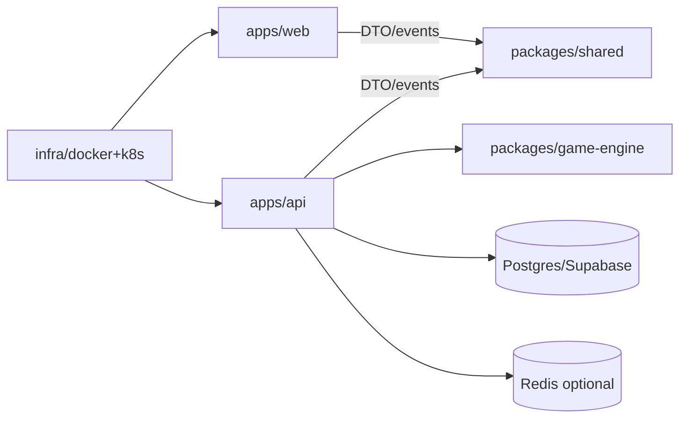

# Final Wire — Project Architecture

> Мета: один GitHub-репозиторій, прозора структура, швидкий локальний старт, чисті межі між frontend/backend/game logic/infra.

## 1. Рекомендація

Для цього проєкту найкраще: **Monorepo + pnpm workspaces + Turborepo**.

Чому:

- один репозиторій = простіше вести MVP і портфоліо;
- спільні типи/схеми без дублювання;
- синхронний versioning між `web`, `api`, `shared`;
- прості CI/CD pipelines;
- менше тертя при рефакторингу контрактів socket/http.

Коли НЕ треба монорепо:

- якщо команди повністю незалежні;
- якщо різні release cycle і різні права доступу.

У твоєму випадку це не так, тому монорепо логічно.

---

## 2. Repository Layout

```txt
core-failure/
  apps/
    web/                        # React client (Operator + Expert UI)
    api/                        # NestJS API + WebSocket Gateway

  packages/
    shared/                     # shared TS types, enums, zod schemas, events
    game-engine/                # server-side game domain (generation/validation)
    ui-kit/                     # optional shared UI primitives for web
    config/                     # shared eslint/tsconfig/prettier/jest presets

  infra/
    docker/
      Dockerfile.web
      Dockerfile.api
      docker-compose.yml
    k8s/
      base/
      overlays/
        dev/
        prod/
    scripts/
      migrate.ps1
      seed.ps1

  docs/
    FinalWire.md
    FinalWire-Database.md
    FinalWire-Architecture.md
    api-events.md
    adr/

  .github/
    workflows/
      ci.yml
      cd.yml

  package.json
  pnpm-workspace.yaml
  turbo.json
  tsconfig.base.json
  .editorconfig
  .gitignore
  README.md
```

---

## 3. Responsibility Boundaries

### 3.1 `apps/web`

Відповідальність:

- UI/UX;
- socket/http клієнт;
- role-based рендер (Operator/Expert);
- локальний client state.

Не має:

- authoritative game logic;
- доступу до `solution_state`.

### 3.2 `apps/api`

Відповідальність:

- room/session lifecycle;
- auth/guest identity;
- socket gateway;
- authoritative validation;
- persistence.

### 3.3 `packages/shared`

Відповідальність:

- DTO контракти;
- socket event names;
- enums;
- zod schemas для transport-level validation.

Не має:

- секретів;
- server-only рішень модулів.

### 3.4 `packages/game-engine`

Відповідальність:

- генерація раунду (seed-based);
- module validators;
- penalties/win-loss rules.

Критично:

- пакет імпортується **лише з `api`**;
- не експортується у `web` (щоб не текли відповіді).

### 3.5 `infra`

Відповідальність:

- docker/k8s manifests;
- локальний compose;
- ops scripts.

---

## 4. Workspace Configuration

`pnpm-workspace.yaml`:

```yaml
packages:
  - 'apps/*'
  - 'packages/*'
```

Root `package.json` (ідея):

```json
{
  "private": true,
  "name": "core-failure",
  "packageManager": "pnpm@10",
  "scripts": {
    "dev": "turbo run dev --parallel",
    "build": "turbo run build",
    "test": "turbo run test",
    "lint": "turbo run lint",
    "typecheck": "turbo run typecheck"
  }
}
```

`turbo.json` (ідея):

```json
{
  "$schema": "https://turborepo.org/schema.json",
  "tasks": {
    "dev": { "cache": false, "persistent": true },
    "build": { "dependsOn": ["^build"], "outputs": ["dist/**", "build/**"] },
    "test": { "dependsOn": ["^build"], "outputs": [] },
    "lint": { "outputs": [] },
    "typecheck": { "dependsOn": ["^typecheck"], "outputs": [] }
  }
}
```

---

## 5. Detailed App Structure

## 5.1 `apps/web`

```txt
apps/web/
  src/
    app/
      router/
      providers/
    pages/
      lobby/
      game/
      result/
    features/
      room/
      session/
      operator/
      expert/
      modules/
    entities/
      player/
      game/
    shared/
      api/
      socket/
      lib/
      ui/
      styles/
  public/
  index.html
  vite.config.ts
```

## 5.2 `apps/api`

```txt
apps/api/
  src/
    main.ts
    app.module.ts
    common/
      guards/
      pipes/
      filters/
      interceptors/
    modules/
      auth/
      players/
      rooms/
      sessions/
      game-gateway/
      health/
    domain/
      game/
        services/
        serializers/
        policies/
    persistence/
      db/
      repositories/
      migrations/
  test/
```

## 5.3 `packages/shared`

```txt
packages/shared/
  src/
    events/
    dto/
    schemas/
    enums/
    types/
  package.json
```

## 5.4 `packages/game-engine`

```txt
packages/game-engine/
  src/
    core/
      generator/
      validator/
      scoring/
    modules/
      wires/
      glyphs/
      switches/
      keypad/
    utils/
  package.json
```

---

## 6. Module Isolation Strategy

Кожен ігровий модуль (wires/glyphs/...) має однаковий контракт:

- `generate(seed, difficulty) -> moduleState + solution`
- `toOperatorView(state) -> publicState`
- `validateAction(state, solution, action) -> result`
- `applyResult(state, result) -> nextState`

Це дає:

- тестованість;
- взаємозамінність модулів;
- просте масштабування кількості модулів.

---

## 7. Data & Secrets Boundaries

- `.env` тільки в `apps/api` і `apps/web` (окремі файли).
- Ніяких секретів у `packages/*`.
- `solution_state` і правила валідації тільки на сервері.
- Client отримує тільки role-safe DTO з `shared`.

---

## 8. GitHub Strategy

Один репозиторій: `core-failure`.

Гілки:

- `main` — production-ready.
- `develop` — інтеграція.
- feature branches: `feat/<scope>-<short-name>`.

Приклад:

- `feat/web-lobby-ui`
- `feat/api-room-lifecycle`
- `feat/engine-wires-module`

PR policy:

- мінімум 1 review (або self-review checklist якщо solo);
- обовʼязково `lint + typecheck + tests` у CI;
- squash merge.

---

## 9. CI/CD Skeleton

CI (`.github/workflows/ci.yml`):

- install pnpm;
- restore cache;
- `pnpm lint`;
- `pnpm typecheck`;
- `pnpm test`;
- `pnpm build`.

CD (`cd.yml`, пізніше):

- build/push docker images (`web`, `api`);
- deploy manifests у k8s;
- run migrations before rolling update.

---

## 10. Environments

- `local`: docker-compose + Supabase cloud project.
- `staging`: k8s namespace `staging`.
- `prod`: k8s namespace `prod`.

Config approach:

- `env.example` в репо;
- реальні значення через GitHub Secrets / k8s Secrets.

---

## 11. ADR Process (важливо)

У `docs/adr` фіксуй ключові рішення:

- вибір ORM (Drizzle/Prisma);
- Socket.IO vs ws;
- Redis introduction;
- strategy для reconnect/state recovery.

Формат ADR:

- Context
- Decision
- Consequences

---

## 12. Obsidian Visualization



---

## 13. Recommendation Summary

Для твого кейсу оптимально:

1. Один GitHub-репозиторій.
2. Monorepo на `pnpm workspaces`.
3. `shared` для контрактів.
4. `game-engine` тільки для сервера.
5. `web` і `api` як окремі deploy units.

Це дає баланс швидкості MVP і чистої архітектури для росту.
