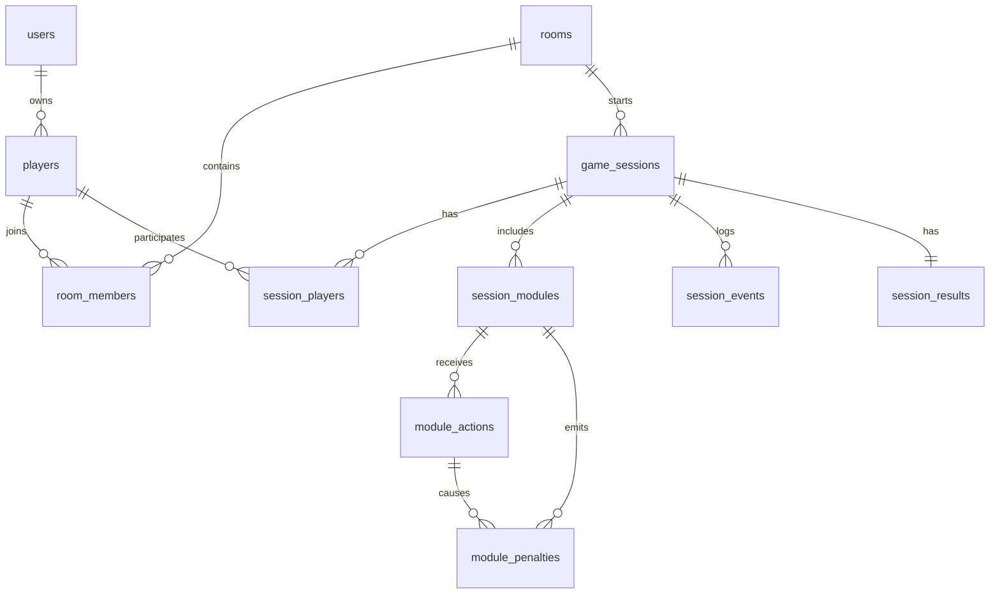

# Final Wire — Database Design (MVP)

> Ціль: реляційна схема для lobby + realtime sessions + audit + results.

## 1. Scope

Покриваємо:

- guests + optional auth users;
- rooms/lobby;
- game sessions;
- session players + roles;
- modules + actions + penalties;
- фінальний результат/score;
- базовий audit trail.

Не покриваємо (поки):

- achievements;
- global leaderboard сезони;
- full replay event sourcing.

---

## 2. ER Diagram (Obsidian Mermaid)

---

## 3. Entities (Readable Tables)

### 3.1 `users`

| Field         | Type        | Key | Null | Notes                 |
| ------------- | ----------- | --- | ---- | --------------------- |
| id            | uuid        | PK  | no   | user id               |
| email         | text        |     | yes  | optional              |
| auth_provider | text        |     | no   | `email/google/github` |
| created_at    | timestamptz |     | no   | default now           |

### 3.2 `players`

| Field        | Type        | Key            | Null | Notes              |
| ------------ | ----------- | -------------- | ---- | ------------------ |
| id           | uuid        | PK             | no   | player id          |
| user_id      | uuid        | FK -> users.id | yes  | null for guest     |
| guest_token  | text        | UNIQUE         | yes  | required for guest |
| display_name | text        |                | no   | lobby name         |
| is_guest     | bool        |                | no   | guest/auth flag    |
| created_at   | timestamptz |                | no   | default now        |
| last_seen_at | timestamptz |                | no   | heartbeat/update   |

Rules:

- guest: `is_guest = true` and `guest_token is not null`
- auth: `user_id is not null`

### 3.3 `rooms`

| Field             | Type          | Key              | Null | Notes                          |
| ----------------- | ------------- | ---------------- | ---- | ------------------------------ |
| id                | uuid          | PK               | no   | room id                        |
| room_code         | text          | UNIQUE           | no   | 6–8 chars                      |
| host_player_id    | uuid          | FK -> players.id | no   | current host                   |
| status            | room_status_t |                  | no   | `LOBBY/IN_GAME/CLOSED/EXPIRED` |
| difficulty        | difficulty_t  |                  | no   | `EASY/NORMAL/HARD/CUSTOM`      |
| max_players       | int           |                  | no   | CHECK 2..4                     |
| invite_link_token | text          | UNIQUE           | no   | shareable link token           |
| created_at        | timestamptz   |                  | no   | default now                    |
| updated_at        | timestamptz   |                  | no   | trigger update                 |
| expires_at        | timestamptz   |                  | yes  | ttl for stale lobby            |

### 3.4 `room_members`

| Field     | Type        | Key              | Null | Notes            |
| --------- | ----------- | ---------------- | ---- | ---------------- |
| id        | uuid        | PK               | no   | membership id    |
| room_id   | uuid        | FK -> rooms.id   | no   | room             |
| player_id | uuid        | FK -> players.id | no   | player           |
| is_ready  | bool        |                  | no   | ready flag       |
| is_host   | bool        |                  | no   | snapshot flag    |
| joined_at | timestamptz |                  | no   | joined timestamp |
| left_at   | timestamptz |                  | yes  | null if active   |

Constraints:

- unique `(room_id, player_id)`

### 3.5 `game_sessions`

| Field             | Type          | Key            | Null | Notes                        |
| ----------------- | ------------- | -------------- | ---- | ---------------------------- |
| id                | uuid          | PK             | no   | session id                   |
| room_id           | uuid          | FK -> rooms.id | no   | origin room                  |
| seed              | text          |                | no   | deterministic generation     |
| difficulty        | difficulty_t  |                | no   | frozen for run               |
| status            | game_status_t |                | no   | `ACTIVE/WON/LOST/ABANDONED`  |
| started_at        | timestamptz   |                | no   | start time                   |
| ends_at           | timestamptz   |                | no   | deadline                     |
| ended_at          | timestamptz   |                | yes  | finalization time            |
| initial_stability | int           |                | no   | default 100                  |
| final_stability   | int           |                | yes  | 0..100                       |
| mistake_count     | int           |                | no   | default 0                    |
| end_reason        | text          |                | yes  | timeout/stability/disconnect |

### 3.6 `session_players`

| Field           | Type        | Key                    | Null | Notes             |
| --------------- | ----------- | ---------------------- | ---- | ----------------- |
| id              | uuid        | PK                     | no   | session member id |
| session_id      | uuid        | FK -> game_sessions.id | no   | session           |
| player_id       | uuid        | FK -> players.id       | no   | player            |
| role            | role_t      |                        | no   | `OPERATOR/EXPERT` |
| connected       | bool        |                        | no   | online flag       |
| reconnect_count | int         |                        | no   | default 0         |
| joined_at       | timestamptz |                        | no   | joined time       |
| left_at         | timestamptz |                        | yes  | left time         |

Constraints:

- unique `(session_id, player_id)`

### 3.7 `session_modules`

| Field          | Type           | Key                    | Null | Notes                          |
| -------------- | -------------- | ---------------------- | ---- | ------------------------------ |
| id             | uuid           | PK                     | no   | module instance id             |
| session_id     | uuid           | FK -> game_sessions.id | no   | session                        |
| module_key     | module_key_t   |                        | no   | `WIRES/GLYPHS/SWITCHES/KEYPAD` |
| slot_index     | int            |                        | no   | position on panel              |
| state          | module_state_t |                        | no   | `PENDING/SOLVED/FAILED/LOCKED` |
| public_state   | jsonb          |                        | no   | operator-visible state         |
| solution_state | jsonb          |                        | no   | server-only                    |
| mistake_count  | int            |                        | no   | default 0                      |
| solved_at      | timestamptz    |                        | yes  | solve timestamp                |

Constraints:

- unique `(session_id, slot_index)`

### 3.8 `module_actions`

| Field             | Type        | Key                      | Null | Notes                     |
| ----------------- | ----------- | ------------------------ | ---- | ------------------------- |
| id                | uuid        | PK                       | no   | action id                 |
| session_module_id | uuid        | FK -> session_modules.id | no   | target module             |
| session_player_id | uuid        | FK -> session_players.id | no   | actor                     |
| action_type       | text        |                          | no   | e.g. `CUT_WIRE`           |
| payload           | jsonb       |                          | no   | action payload            |
| accepted          | bool        |                          | no   | validation result         |
| reject_reason     | text        |                          | yes  | filled when rejected      |
| server_time_ms    | int         |                          | yes  | latency/server processing |
| created_at        | timestamptz |                          | no   | action time               |

### 3.9 `module_penalties`

| Field             | Type        | Key                      | Null | Notes                     |
| ----------------- | ----------- | ------------------------ | ---- | ------------------------- |
| id                | uuid        | PK                       | no   | penalty id                |
| session_module_id | uuid        | FK -> session_modules.id | no   | module                    |
| action_id         | uuid        | FK -> module_actions.id  | no   | source action             |
| stability_delta   | int         |                          | no   | usually negative          |
| time_delta_sec    | int         |                          | no   | usually negative          |
| penalty_type      | text        |                          | no   | stability/time/lock/noise |
| meta              | jsonb       |                          | yes  | optional details          |
| created_at        | timestamptz |                          | no   | timestamp                 |

### 3.10 `session_events`

| Field             | Type        | Key                      | Null | Notes                         |
| ----------------- | ----------- | ------------------------ | ---- | ----------------------------- |
| id                | uuid        | PK                       | no   | event id                      |
| session_id        | uuid        | FK -> game_sessions.id   | no   | session                       |
| session_player_id | uuid        | FK -> session_players.id | yes  | null for system events        |
| event_type        | text        |                          | no   | `JOIN`, `DISCONNECT`, etc     |
| event_payload     | jsonb       |                          | yes  | event data                    |
| visibility        | text        |                          | no   | `SERVER/ALL/OPERATOR/EXPERTS` |
| created_at        | timestamptz |                          | no   | timestamp                     |

### 3.11 `session_results`

| Field              | Type        | Key                        | Null | Notes               |
| ------------------ | ----------- | -------------------------- | ---- | ------------------- |
| session_id         | uuid        | PK, FK -> game_sessions.id | no   | one row per session |
| won                | bool        |                            | no   | win/loss            |
| score              | int         |                            | no   | final score         |
| time_remaining_sec | int         |                            | no   | remaining time      |
| final_stability    | int         |                            | no   | 0..100              |
| mistakes           | int         |                            | no   | total mistakes      |
| module_summary     | jsonb       |                            | yes  | per-module summary  |
| created_at         | timestamptz |                            | no   | timestamp           |

---

## 4. Cardinalities

- `users 1 -> N players`
- `rooms 1 -> N room_members`
- `players 1 -> N room_members`
- `rooms 1 -> N game_sessions`
- `game_sessions 1 -> N session_players`
- `game_sessions 1 -> N session_modules`
- `session_modules 1 -> N module_actions`
- `module_actions 1 -> N module_penalties`
- `game_sessions 1 -> N session_events`
- `game_sessions 1 -> 1 session_results`

---

## 5. Key Constraints

- `room_code`, `invite_link_token` unique.
- `max_players` CHECK `(max_players between 2 and 4)`.
- stability CHECK `0..100`.
- role/status/difficulty/module enums через Postgres ENUM.
- `solution_state` не віддається в клієнтські DTO.

---

## 6. Index Plan

- `rooms(room_code)` unique
- `rooms(status, created_at)`
- `room_members(room_id, left_at)`
- `game_sessions(room_id, started_at desc)`
- `game_sessions(status, started_at)`
- `session_players(session_id, role)`
- `session_modules(session_id, slot_index)` unique
- `module_actions(session_module_id, created_at)`
- `module_actions(session_player_id, created_at)`
- `session_events(session_id, created_at)`
- GIN: `session_events(event_payload)` (+ optional `module_actions(payload)`)

---

## 7. Obsidian Links

- `[[FinalWire]]`
- `[[FinalWire-API]]`
- `[[FinalWire-Game-Rules]]`
- `[[FinalWire-Infra]]`

Теги:

- `#core-failure`
- `#database`
- `#mvp`
- `#architecture`
